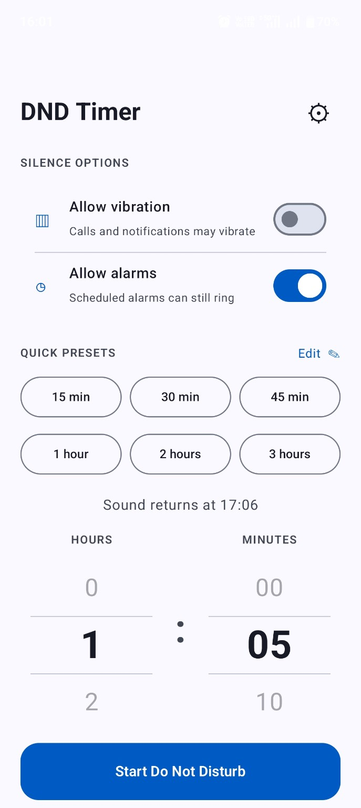
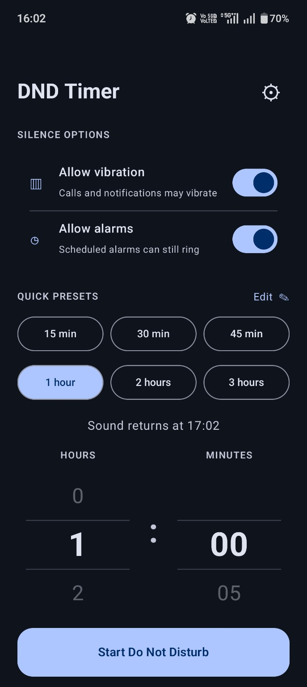
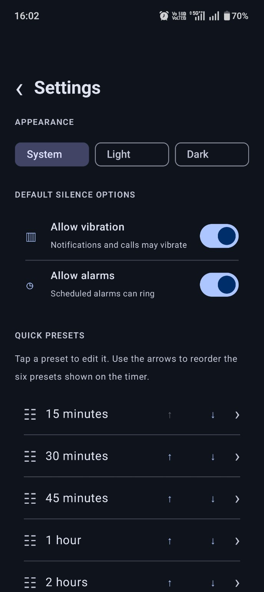
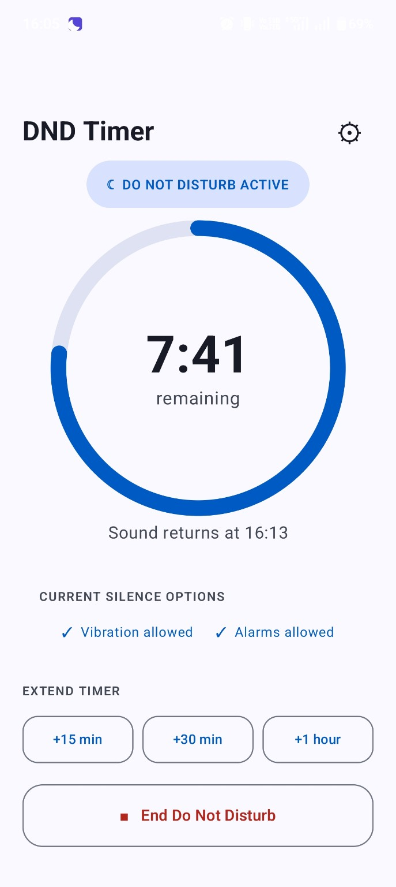
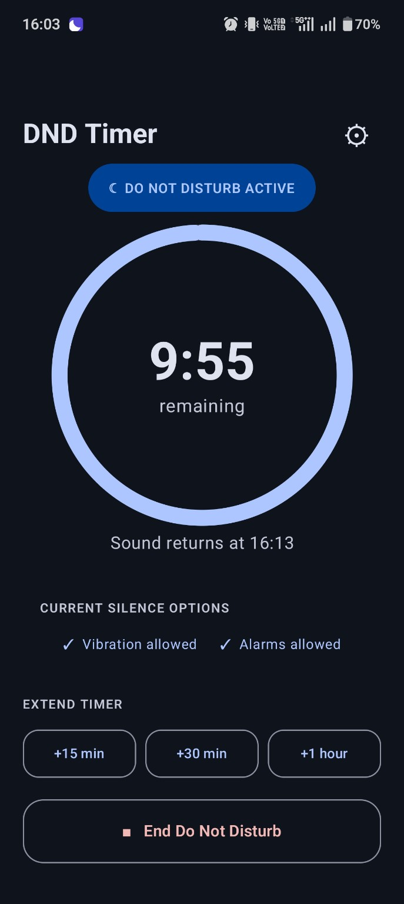
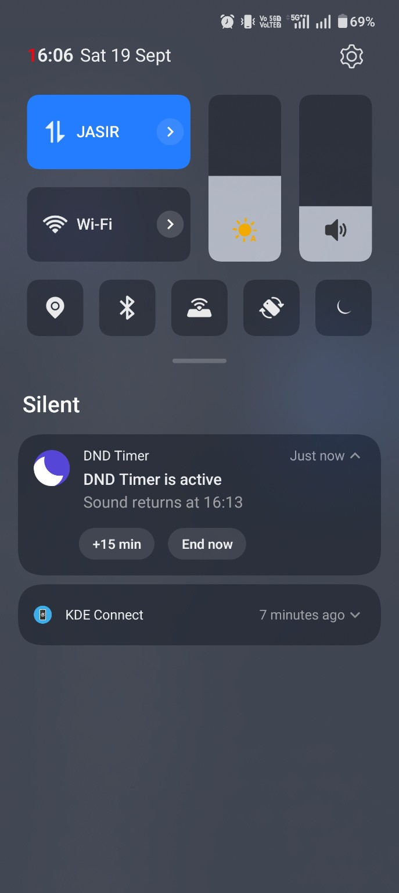
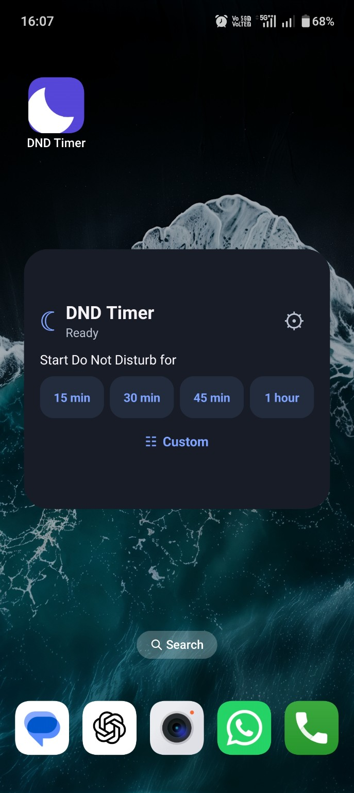
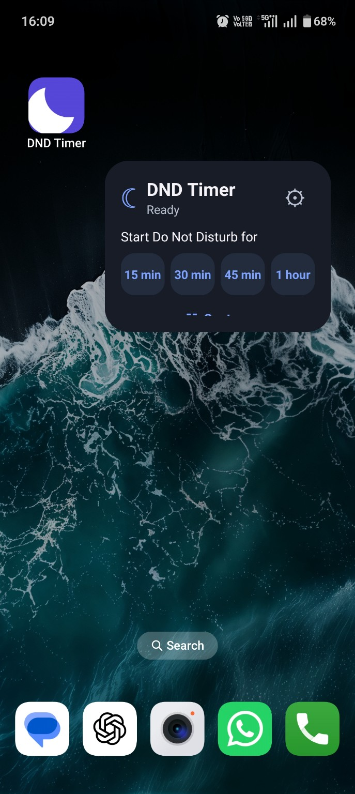
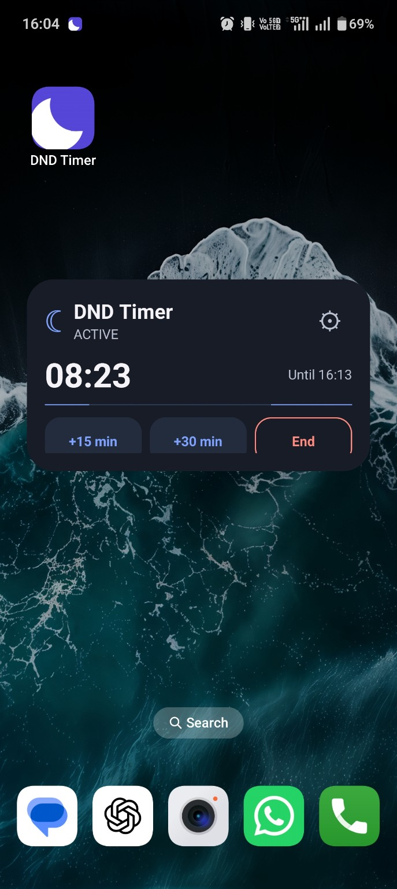

# DND Timer for Android

DND Timer is a small Android utility that turns on **Do Not Disturb** for a precise duration and restores the phone's previous sound settings automatically when the timer ends.

It is designed for meetings, focused work, prayer, sleep, study, and any situation where permanent DND schedules are too rigid.

## Highlights

- Thumb-friendly swipe wheels for hours and minutes
- Six quick presets in two rows
- Editable and reorderable presets
- System, light, and dark appearance modes
- Separate **Allow vibration** and **Allow alarms** controls
- Exact sound-return time before starting
- Live countdown and progress indicator
- Extend an active timer by 15 minutes, 30 minutes, or 1 hour
- Confirmation before ending DND early
- Resizable home-screen widget with idle and active controls
- Quick Settings tile
- Persistent notification with **+15 min** and **End now** actions
- Timer recovery after device restart or app update
- Android dynamic-colour support

## Screenshots

| Timer — light | Timer — dark | Settings — dark |
| --- | --- | --- |
|  |  |  |

| Active — light | Active — dark | Notification and tile |
| --- | --- | --- |
|  |  |  |

### Home-screen widget

| Ready — wide | Ready — narrow | Active |
| --- | --- | --- |
|  |  |  |

## Install the test build

1. Open the repository's **Actions** tab.
2. Open the latest successful **Build Android APK** run.
3. Under **Artifacts**, download **DND-Timer-APK**. A GitHub account may be required to download Actions artifacts.
4. Extract the downloaded ZIP.
5. Install `DND-Timer-v1.1-debug.apk` on the Android device.
6. If Android blocks the installation, allow installation from the browser or file manager used to open the APK.

The first v1.1 installation may not update the older v1.0 test build because v1.0 used a temporary signing key. If Android reports a conflict, uninstall v1.0 once and install v1.1. Builds from v1.1 onward use the same project-specific development key and can update in place.

> This is a development build. Review the source and use it at your own discretion.

## First-run setup

1. Open **DND Timer**.
2. On the DND access card, tap **Allow**.
3. Enable DND Timer on Android's **Do Not Disturb access** screen.
4. Optionally grant **Alarms & reminders** access for precise timer completion. Without it, Android may delay the end slightly while the phone is idle.
5. On Android 13 or later, allow notifications when requested after starting the first timer.

## Using the app

1. Choose whether calls and notifications may vibrate.
2. Choose whether scheduled alarms may ring.
3. Tap a preset or swipe the hour and minute wheels.
4. Check the displayed **Sound returns at** time.
5. Tap **Start Do Not Disturb**.

While DND is active, use the app, widget, or notification to extend the timer. Ending DND from the app or widget opens a confirmation screen before sound is restored.

## Add the widget

1. Touch and hold an empty area of the Android home screen.
2. Select **Widgets**.
3. Find **DND Timer**.
4. Drag the widget to the home screen.
5. Resize it to the preferred width.

When idle, the widget starts a configured preset or opens the app for a custom duration. While active, it shows the remaining time and provides extension and end controls.

## Add the Quick Settings tile

1. Open Android's Quick Settings panel.
2. Tap the edit button.
3. Find **DND Timer** in the available tiles.
4. Drag it into the active tiles.

Tapping the tile opens the timer picker, allowing the duration and silence options to be confirmed before DND starts.

## Sound behaviour

| Vibration | Alarms | Behaviour |
| --- | --- | --- |
| Off | Off | Total silence |
| Off | On | Only scheduled alarms can make sound |
| On | Off | Calls and notifications may vibrate; alarm audio is temporarily muted |
| On | On | Calls and notifications may vibrate; scheduled alarms can ring |

The app captures the previous DND filter, ringer mode, and alarm volume before starting. It restores those values when the timer ends or the user ends DND early.

## Android requirements

- Minimum Android version: Android 8.0 (API 26)
- Target Android version: Android 15 (API 35)
- JDK 17
- Android SDK 35

## Build from source

1. Download and extract `DND-Timer-Android-Source-v1.1.zip`.
2. Open the included `dnd-timer` folder in Android Studio.
3. Allow Android Studio to install SDK 35 and complete the Gradle sync.
4. Select **Build > Build APK(s)**.
5. Find the APK under `app/build/outputs/apk/debug/`.

The source package does not include a machine-generated Gradle wrapper JAR. Android Studio can configure a local Gradle runtime when importing the project.

## Build with GitHub Actions

The included workflow builds the APK on every push to `main`. It can also be started manually:

1. Open **Actions > Build Android APK**.
2. Select **Run workflow**.
3. Choose the `main` branch and confirm.
4. Open the completed run and download **DND-Timer-APK** under **Artifacts**.

Artifacts are retained for 14 days.

## Known improvements planned

- Refine widget responsiveness so every control remains visible in common 4×2 and 3×2 launcher sizes.
- Increase the visual weight of the Quick Settings tile icon.
- Display the Quick Settings tile in its blue active state while the DND timer is running.

## Project structure

- `MainActivity.kt` — permission routing and application state
- `ui/DndTimerApp.kt` — Compose setup, settings, and countdown screens
- `settings/AppPreferences.kt` — presets and appearance preferences
- `timer/TimerManager.kt` — timer orchestration
- `timer/DndController.kt` — DND, ringer, and alarm changes
- `timer/AlarmScheduler.kt` — precise and fallback timer expiry
- `timer/TimerNotification.kt` — active-timer notification
- `quicktile/DndTileService.kt` — Quick Settings entry point
- `widget/DndTimerWidgetProvider.kt` — home-screen widget behaviour

## Device compatibility

Android manufacturers can customise DND, alarms, widgets, and background execution. The implementation uses public Android APIs and restores captured values. Additional device testing is especially useful on Samsung, OnePlus/Oppo, Xiaomi, and Pixel phones.

## Status

Version 1.1 is a functional test release. Feedback and contributions are welcome through GitHub Issues.
