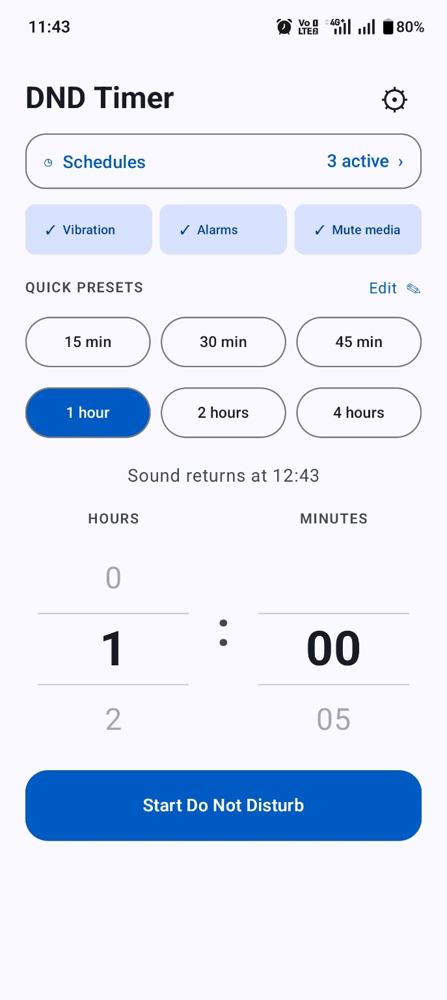

# DND Timer for Android

DND Timer is a small Android utility that turns on **Do Not Disturb** for a precise duration and restores the phone's previous sound settings automatically when the timer ends.

It is designed for meetings, focused work, prayer, sleep, study, and any situation where permanent DND schedules are too rigid.

## Highlights

- Thumb-friendly swipe wheels for hours and minutes
- Six quick presets in two rows
- Editable and reorderable presets
- System, light, and dark appearance modes
- Separate **Allow vibration** and **Allow alarms** controls
- Compact one-row silence controls keep the Start button within easy reach
- Default-on **Mute media** control for music, videos, and games
- Repeating DND schedules with weekday and overnight support
- System, 12-hour, and 24-hour time display modes
- Exact sound-return time before starting
- Live countdown and progress indicator
- Extend an active timer by 15 minutes, 30 minutes, or 1 hour
- Confirmation before ending DND early
- Resizable home-screen widget with idle and active controls
- Quick Settings tile
- Persistent notification with **+15 min** and **End now** actions
- Timer recovery after device restart or app update
- Android dynamic-colour support

## Screenshots

| Timer — light | Timer — dark | Settings — dark |
| --- | --- | --- |
|  |  |  |

| Active — light | Active — dark | Notification and tile |
| --- | --- | --- |
|  |  |  |

### Home-screen widget

| Ready — wide | Ready — narrow | Active |
| --- | --- | --- |
|  |  |  |

## Install the test build

1. Open the repository's **Actions** tab.
2. Open the latest successful **Build Android APK** run.
3. Under **Artifacts**, download **DND-Timer-v1.3.1-Release**. A GitHub account may be required to download Actions artifacts.
4. Extract the downloaded ZIP.
5. Install `DND-Timer-v1.3.1-release.apk` on the Android device.
6. If Android blocks the installation, allow installation from the browser or file manager used to open the APK.

Version 1.2.1 introduces the permanent DSYNZ signing certificate. If Android reports an app conflict with an earlier test build, uninstall that test build once before installing 1.2.1. Later DSYNZ-signed updates can install normally without removing the app.

> This is a pre-release test build. Review the source and use it at your own discretion.

## First-run setup

1. Open **DND Timer**.
2. On the DND access card, tap **Allow**.
3. Enable DND Timer on Android's **Do Not Disturb access** screen.
4. Optionally grant **Alarms & reminders** access for precise timer completion. Without it, Android may delay the end slightly while the phone is idle.
5. On Android 13 or later, allow notifications when requested after starting the first timer.

## Using the app

1. Choose whether calls and notifications may vibrate.
2. Choose whether scheduled alarms may ring.
3. Choose whether media audio should be muted. This is on by default.
4. Tap a preset or swipe the hour and minute wheels.
5. Check the displayed **Sound returns at** time.
6. Tap **Start Do Not Disturb**.

While DND is active, use the app, widget, or notification to extend the timer. Ending DND from the app or widget opens a confirmation screen before sound is restored.

## Add a repeating schedule

1. Tap **Schedules** on the timer screen.
2. Tap **+** or **Add schedule**.
3. Enter a title and choose the start and end times.
4. Select one or more weekdays, then tap **Save**.

Schedules can cross midnight, such as 22:00–07:00. Use the switch beside a schedule to pause it without deleting it. Tap an existing schedule to edit or delete it. Schedule times use the device timezone, and their display follows the **System / 12 hour / 24 hour** choice in Settings.

## Add the widget

1. Touch and hold an empty area of the Android home screen.
2. Select **Widgets**.
3. Find **DND Timer**.
4. Drag the widget to the home screen.
5. Resize it to the preferred width.

When idle, the widget starts a configured preset or opens the app for a custom duration. While active, it shows the remaining time and provides extension and end controls.

Version 1.2 includes separate compact and wide layouts. The widget automatically adapts to common 3×2 and 4×2 launcher sizes when added or resized.

## Add the Quick Settings tile

1. Open Android's Quick Settings panel.
2. Tap the edit button.
3. Find **DND Timer** in the available tiles.
4. Drag it into the active tiles.

Tapping the tile opens the timer picker, allowing the duration and silence options to be confirmed before DND starts.

The tile uses a heavier moon icon for better visibility. Android displays it in the system's active colour while the DND timer is running.

## Keep timers reliable

Some Android manufacturers restrict apps that have not been opened recently. The **Keep timers reliable** section at the bottom of Settings provides shortcuts and device-independent guidance:

1. Open **App info** and turn off **Manage app if unused**, **Pause app activity if unused**, or a similarly named option.
2. Under **Battery**, choose **Unrestricted** or allow background activity when that option exists.
3. Keep notifications and **Alarms & reminders** access enabled.

Setting names vary between Android versions and manufacturers. The app still uses Android's scheduled alarm APIs and does not run a permanent background service.

## Sound behaviour

| Option | On | Off |
| --- | --- | --- |
| Allow vibration | Calls and notifications may vibrate | Calls and notifications do not vibrate |
| Allow alarms | Scheduled alarms can ring | Alarm audio is temporarily muted |
| Mute media | Music, videos, and games are temporarily muted | Media volume is left unchanged |

The app captures the previous DND filter, ringer mode, alarm volume, and media volume before starting. It restores those values when the timer ends or the user ends DND early.

## Android requirements

- Minimum Android version: Android 8.0 (API 26)
- Target Android version: Android 16 (API 36)
- JDK 17
- Android SDK 36

## Build from source

1. Download or clone the source repository.
2. Open the included `dnd-timer` folder in Android Studio.
3. Allow Android Studio to install SDK 36 and complete the Gradle sync.
4. Select **Build > Build APK(s)**.
5. Find the APK under `app/build/outputs/apk/debug/`.

The source package does not include a machine-generated Gradle wrapper JAR. Android Studio can configure a local Gradle runtime when importing the project.

## Build with GitHub Actions

The included workflow builds the APK on every push to `main`. It can also be started manually:

1. Open **Actions > Build Android APK**.
2. Select **Run workflow**.
3. Choose the `main` branch and confirm.
4. Open the completed run and download **DND-Timer-APK** under **Artifacts**.

Artifacts are retained for 14 days.

## Project structure

- `MainActivity.kt` — permission routing and application state
- `ui/DndTimerApp.kt` — Compose setup, settings, and countdown screens
- `settings/AppPreferences.kt` — presets and appearance preferences
- `timer/TimerManager.kt` — timer orchestration
- `timer/DndController.kt` — DND, ringer, and alarm changes
- `timer/AlarmScheduler.kt` — precise and fallback timer expiry
- `timer/TimerNotification.kt` — active-timer notification
- `schedule/` — repeating schedule storage, alarm calculation, and receivers
- `quicktile/DndTileService.kt` — Quick Settings entry point
- `widget/DndTimerWidgetProvider.kt` — home-screen widget behaviour

## Device compatibility

Android manufacturers can customise DND, alarms, widgets, and background execution. The implementation uses public Android APIs and restores captured values. Additional device testing is especially useful on Samsung, OnePlus/Oppo, Xiaomi, and Pixel phones.

## Status

Version 1.3.1 compacts the timer screen's silence options into a single row so the Start button remains visible without scrolling. It also includes the recurring schedules, configurable clock formatting, and media muting introduced in 1.3.0. It is being prepared for Google Play and F-Droid. Feedback and contributions are welcome through GitHub Issues.

## Privacy and licence

DND Timer does not collect, transmit, or share personal data. See [PRIVACY.md](PRIVACY.md) for details.

Copyright © 2026 DSYNZ. Licensed under the [GNU General Public License v3.0](LICENSE).
